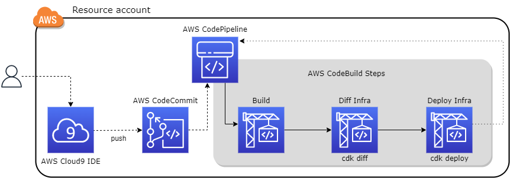

## AWS CodePipeline generator to deploy CDK project

This project creates a pipeline with AWS CodePipeline to be able to deploy any project created in AWS CDK. This project can be updated and new steps can be added which will automatically update the pipeline. It is a project that creates and updates itself.



### Stack

* App stack: Create an AWS CodePipeline. In app.py we define an app. Our app has a pipeline.
  * AWS CodePipeline is a fully managed continuous delivery service that helps you automate your release pipelines for fast and reliable application and infrastructure updates. CodePipeline automates the build, test, and deploy phases of your release process every time there is a code change, based on the release model you define. This enables you to rapidly and reliably deliver features and updates. You can easily integrate AWS CodePipeline with third-party services such as GitHub or with your own custom plugin. With AWS CodePipeline, you only pay for what you use. There are no upfront fees or long-term commitments.
* Pipeline Stack: Set up the pipeline and its steps
  * Define the pipeline trigger. We add our code repository to AWS CodePipeline and an AWS CloudWatch event rule is created between the repository and the pipeline. You can choose your source (more info: https://docs.aws.amazon.com/codepipeline/latest/userguide/pipelines-about-starting.html#change-detection-methods). In this project we select AWS service when it is possible. Therefore, we use AWS CodeCommit.
    * AWS CodeCommit is a secure, highly scalable, managed source control service that hosts private Git repositories. It makes it easy for teams to securely collaborate on code with contributions encrypted in transit and at rest. CodeCommit eliminates the need for you to manage your own source control system or worry about scaling its infrastructure. You can use CodeCommit to store anything from code to binaries. It supports the standard functionality of Git, so it works seamlessly with your existing Git-based tools.
  * Define IAM role. When you create a pipeline, you create a service role or use an existing service role. The service role is not an AWS managed role but is created initially for pipeline creation, and then as new permissions are added to the service role policy, you may need to update the service role for your pipeline. Once your pipeline is created with a service role, you cannot apply a different service role to that pipeline. Attach the recommended policy to the service role.
  * Define the steps. We have three steps created with AWS CodeBuild. AWS CodeBuild is a fully managed continuous integration service that compiles source code, runs tests, and produces software packages that are ready to deploy. With CodeBuild, you don’t need to provision, manage, and scale your own build servers. CodeBuild scales continuously and processes multiple builds concurrently, so your builds are not left waiting in a queue. You can get started quickly by using prepackaged build environments, or you can create custom build environments that use your own build tools. With CodeBuild, you are charged by the minute for the compute resources you use.
    * Build. Step where we download the required dependencies to use AWS CDK
      * The AWS Cloud Development Kit (AWS CDK) is an open-source software development framework to define your cloud application resources using familiar programming languages. In our case Python.
    * cdk diff. Step to check if the new changes are right.
      * The cdk diff command compares the current version of a stack defined in your app with the already-deployed version, or with a saved AWS CloudFormation template, and displays a list of changes.
    * cdk deploy. Step to deploy our pipeline in the selected aws account
      * The cdk deploy subcommand deploys the specified stack(s) to your AWS account. If there is an error an autimatic rollback is executed (feature inherited from AWS CloudFormation).

### Deployment

To get started with the Pipeline generator, you can deploy into your AWS Account by following this [Get Started instructions](./cicd/README.md)

### Standard naming conventions:

Every resource created by CDK has an id and usually a name.
id and name should be the same.
Every resource has the following naming format:
{projectname}-{featurename}

We can create different pipelines to deploy different AWS CDK projects changing only properties.

In order to achieve that in each main app.py is created a Template:

```from string import Template
project_name = properties['project']['name']
##name: functional name to identify a resource created by aws cdk
template = Template(project_name + '-$name')

This template is added as parameter in every new stack:

PipelineStack(app,
              template.substitute(name=properties['pipeline']['pipeline_stack_name']),
              props=properties,
              **template=template**,
              tags=tags)
```      
##### pdoc: Auto-generate API documentation for Python projects
 Place inside app or cicd folder to update pdoc type:
pdoc --html stacks --force